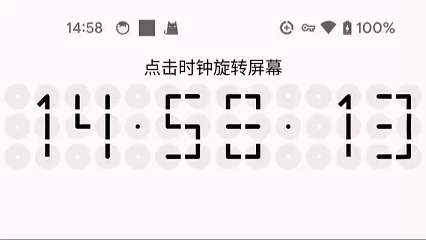

# LineNumberClock


# 用法

添加依赖：

```
implementation("cc.fastcv:line-number-clock:1.0.1")
```


在布局文件中：

````
<?xml version="1.0" encoding="utf-8"?>
<LinearLayout xmlns:android="http://schemas.android.com/apk/res/android"
    xmlns:tools="http://schemas.android.com/tools"
    android:id="@+id/main"
    android:layout_width="match_parent"
    android:layout_height="match_parent"
    android:orientation="vertical"
    tools:context=".MainActivity">

    <cc.fastcv.line_number_clock.LineNumberClockView
        android:id="@+id/view"
        android:layout_width="match_parent"
        android:layout_height="match_parent" />

</LinearLayout>
````

这里说明一下，这个组件使用的自适应宽高比，所以需要固定的大小的话需要你自己去调整适配或者提个issue问我，还可以进行二次开发。


这样，就可以在你的app上看到效果了。




